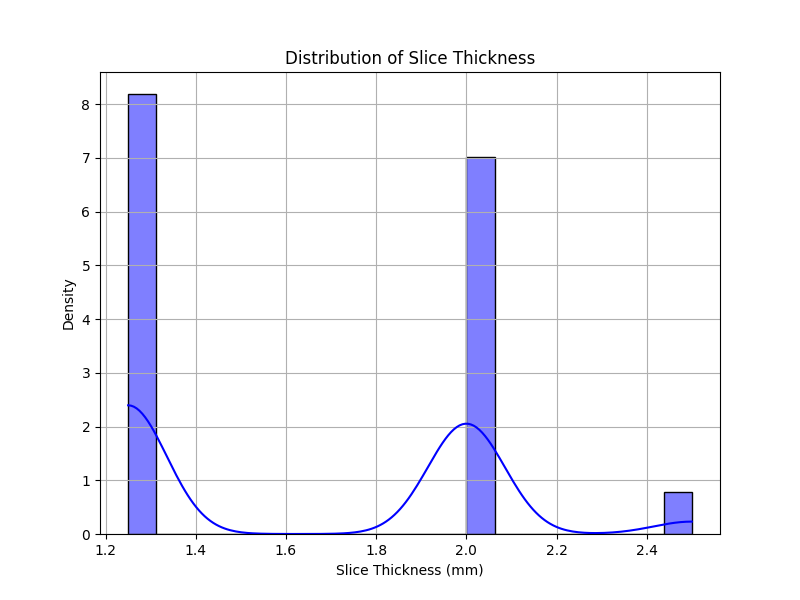
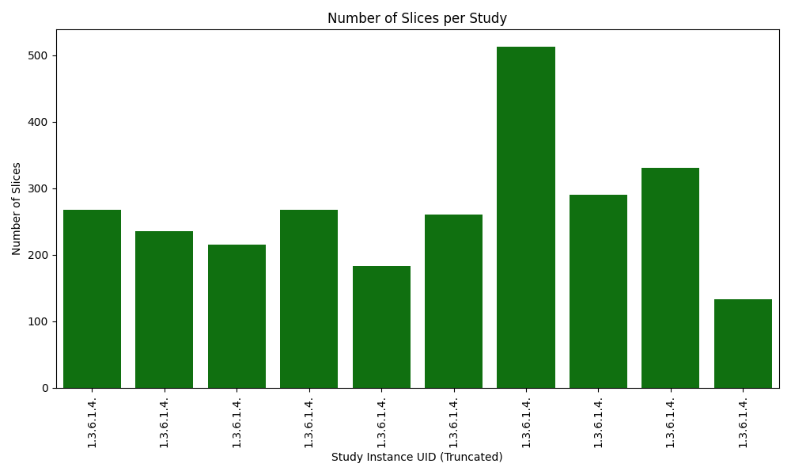

## Visualizations

### Slice Thickness Distribution

A histogram showing the distribution of slice thickness values is provided below. The distribution suggests a relatively tight grouping of slice thickness values, with a slight variance.

### Slices per Study

A bar chart showing the number of slices per study. The data shows that each study contains a similar number of slices.

